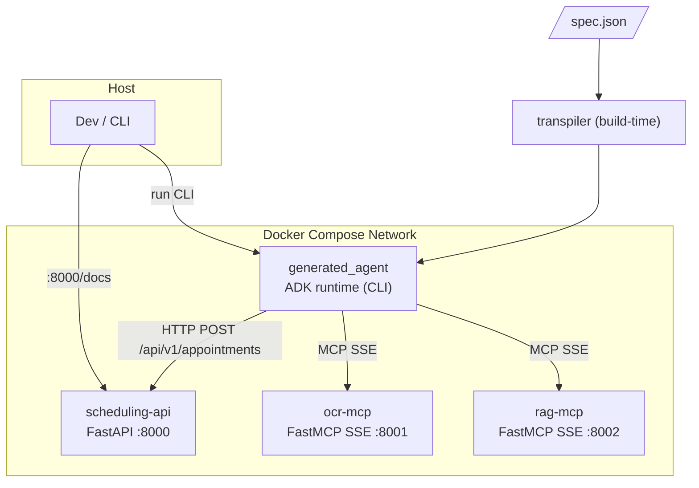
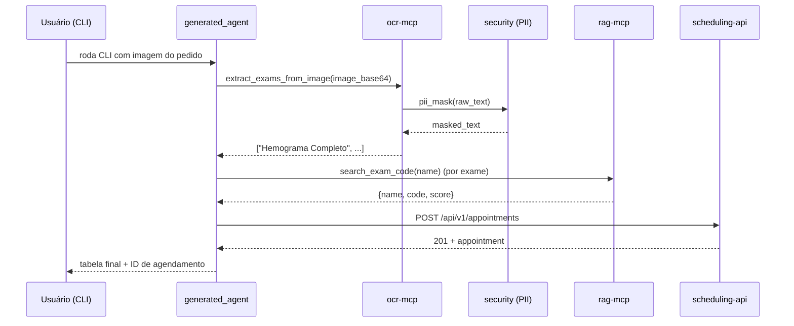

# Arquitetura-alvo

Documento vivo. Atualizado sempre que um contrato público entre subsistemas mudar.

## Visão geral

Cinco serviços rodando em rede Docker Compose, mais dois artefatos fora do runtime (transpilador + agente gerado).



## Serviços

### `transpiler` (build-time, não é container)
- Entrada: `spec.json` validado contra Pydantic `AgentSpec`.
- Saída: pacote Python `generated_agent/` pronto para ser usado via `adk run` ou importado pelo container do agente.
- Interface: `python -m transpiler <spec.json> -o ./generated_agent`.
- Determinístico (mesmo input → mesmo output).

### `ocr-mcp`
- Tecnologia: FastMCP + SSE (`mcp.run(transport="sse", port=8001)`).
- MVP: mock determinístico — dado um hash da imagem, retorna texto canned de um dicionário de fixtures.
- **Camada PII aplicada aqui** antes de retornar (`security.pii_mask(text)`).
- Tools expostas: `extract_exams_from_image(image_base64: str) -> list[str]`.

### `rag-mcp`
- Tecnologia: FastMCP + SSE em `:8002`.
- Catálogo mock de **≥ 100 exames** (nome + código) em memória; busca por similaridade simples (e.g., fuzzy match sobre nome).
- Tools expostas: `search_exam_code(exam_name: str) -> dict` (campos: `name`, `code`, `score`), `list_exams() -> list[dict]`.

### `scheduling-api`
- Tecnologia: FastAPI + Pydantic v2 + Uvicorn em `:8000`.
- Endpoints:
  - `POST /api/v1/appointments` → cria.
  - `GET  /api/v1/appointments/{id}` → lê.
  - `GET  /api/v1/appointments` → lista (paginação simples).
  - `GET  /health` → healthcheck.
- Swagger em `/docs`.
- Armazenamento: in-memory dict atrás de uma interface (trocável).
- **Nunca** recebe PII — a anonimização ocorre upstream.

### `generated_agent`
- Pacote Python gerado pelo transpilador, conforme estrutura ADK:
  ```
  generated_agent/
  ├── __init__.py       # import agent
  ├── agent.py          # root_agent
  ├── requirements.txt
  ├── Dockerfile
  └── .env.example
  ```
- `root_agent = LlmAgent(...)` com `McpToolset(connection_params=StreamableHTTPConnectionParams(url=...))` para OCR e RAG (o ADK atual consome endpoints SSE via essa classe — ver ADR-0001 nota de correção), e OpenAPI toolset (ou HTTP client simples) para a API de agendamento.
- `before_model_callback` aplica PII guard como segunda linha de defesa.

## Contratos entre subsistemas

### OCR MCP → Agente
```jsonc
// tool: extract_exams_from_image
// input
{"image_base64": "<str>"}
// output
["Hemograma Completo", "Glicemia de Jejum", ...]
```
A saída é texto **já mascarado** de PII.

### RAG MCP → Agente
```jsonc
// tool: search_exam_code
// input
{"exam_name": "Hemograma Completo"}
// output
{"name": "Hemograma Completo", "code": "HMG-001", "score": 0.98}
```

### Agente → Scheduling API
```jsonc
// POST /api/v1/appointments
{
  "patient_ref": "anon-abc123",
  "exams": [{"name": "Hemograma Completo", "code": "HMG-001"}],
  "scheduled_for": "2026-05-01T09:00:00Z",
  "notes": null
}
// 201 Created
{
  "id": "apt-42",
  "status": "scheduled",
  "created_at": "2026-04-18T12:00:00Z",
  "patient_ref": "anon-abc123",
  "exams": [...],
  "scheduled_for": "2026-05-01T09:00:00Z"
}
```

### PII Guard (módulo `security/`)
```python
def pii_mask(text: str, language: str = "pt") -> MaskedResult:
    """
    Returns MaskedResult(masked_text: str, entities: list[EntityHit]).
    entities carry only entity_type, start, end, score, and sha256_prefix — never raw values.
    """
```

## Variáveis de ambiente (consolidadas)

| Variável | Quem usa | Exemplo |
|---|---|---|
| `GOOGLE_GENAI_USE_VERTEXAI` | generated_agent | `FALSE` |
| `GOOGLE_API_KEY` | generated_agent | `AIza...` |
| `OCR_MCP_URL` | generated_agent | `http://ocr-mcp:8001/sse` |
| `RAG_MCP_URL` | generated_agent | `http://rag-mcp:8002/sse` |
| `SCHEDULING_API_URL` | generated_agent | `http://scheduling-api:8000` |
| `PII_DEFAULT_LANGUAGE` | security | `pt` |
| `LOG_LEVEL` | todos | `INFO` |

Detalhes em `.env.example`.

## Schema Pydantic do JSON spec

Congelado pela [ADR-0006](adr/0006-spec-schema-and-agent-topology.md). Qualquer campo novo exige nova ADR supersedendo.

```python
from typing import Literal
from pydantic import BaseModel, Field


class McpServerSpec(BaseModel):
    name: str
    url: str                                # ex.: http://ocr-mcp:8001/sse
    tool_filter: list[str] | None = None    # None = todas as tools


class HttpToolSpec(BaseModel):
    name: str
    base_url: str                           # ex.: http://scheduling-api:8000
    openapi_url: str | None = None          # opcional: gerar tools a partir de OpenAPI


class PiiGuardSpec(BaseModel):
    enabled: bool = True
    allow_list: list[str] = []


class GuardrailSpec(BaseModel):
    pii: PiiGuardSpec = Field(default_factory=PiiGuardSpec)


class AgentSpec(BaseModel):
    name: str = Field(pattern=r"^[a-z0-9][a-z0-9-]*$")
    description: str
    model: Literal["gemini-2.5-flash"]      # Literal força revisão ao trocar
    instruction: str                         # prompt multiline, imperativo
    mcp_servers: list[McpServerSpec]
    http_tools: list[HttpToolSpec]
    guardrails: GuardrailSpec = Field(default_factory=GuardrailSpec)
```

Exemplo mínimo (`spec.example.json`):

```json
{
  "name": "medical-order-agent",
  "description": "Agente de agendamento de exames a partir de pedidos médicos",
  "model": "gemini-2.5-flash",
  "instruction": "Você recebe uma imagem...",
  "mcp_servers": [
    {"name": "ocr", "url": "http://ocr-mcp:8001/sse"},
    {"name": "rag", "url": "http://rag-mcp:8002/sse"}
  ],
  "http_tools": [
    {"name": "scheduling", "base_url": "http://scheduling-api:8000", "openapi_url": "http://scheduling-api:8000/openapi.json"}
  ],
  "guardrails": {"pii": {"enabled": true, "allow_list": []}}
}
```

## Assinaturas exatas das tools MCP

Congeladas pelas [ADR-0001](adr/0001-mcp-transport-sse.md) e [ADR-0007](adr/0007-rag-fuzzy-and-catalog.md).

### `ocr-mcp`

```python
@mcp.tool()
def extract_exams_from_image(image_base64: str) -> list[str]:
    """
    Recebe imagem em base64 do pedido médico, retorna lista de nomes de exames.
    A saída passa por security.pii_mask() antes de retornar.
    """
```

### `rag-mcp`

```python
class ExamMatch(BaseModel):
    name: str
    code: str
    score: float   # 0..1 (rapidfuzz /100)

class ExamSummary(BaseModel):
    name: str
    code: str

@mcp.tool()
def search_exam_code(exam_name: str) -> ExamMatch | None:
    """
    Fuzzy match contra catálogo. Threshold 80 (rapidfuzz escala 0-100).
    Retorna None quando nenhum candidato atinge o threshold.
    """

@mcp.tool()
def list_exams(limit: int = 100) -> list[ExamSummary]:
    """Catálogo paginado, útil para fallback quando search_exam_code retorna None."""
```

## Catálogo de exames (CSV)

Formato congelado pela [ADR-0007](adr/0007-rag-fuzzy-and-catalog.md).

- Arquivo: `rag_mcp/data/exams.csv`, UTF-8, separador `,`.
- Header obrigatório na primeira linha.
- Colunas na ordem: `name,code,category,aliases`.
  - `aliases` é lista separada por `|` (ex.: `Hemograma|HMG|HMC`).
- Comentários com `#` **não** são aceitos; use o README do diretório.

## Lista definitiva de entidades PII

Motor: Microsoft Presidio com recognizers BR **escritos neste projeto** (Presidio não oferece reconhecedores brasileiros nativos — ver ADR-0003 nota de correção). Congelado pela [ADR-0003](adr/0003-pii-double-layer.md). Aplicação dupla: dentro do `ocr-mcp` (linha 1) e via `before_model_callback` do agente (linha 2).

| Entidade | Origem | Ação | Placeholder |
|---|---|---|---|
| `BR_CPF` | custom recognizer (regex + dígito verificador via `pycpfcnpj`) | replace | `<CPF>` |
| `BR_CNPJ` | custom recognizer (regex + dígito verificador via `pycpfcnpj`) | replace | `<CNPJ>` |
| `BR_RG` | custom recognizer (regex por UF mais comum) | replace | `<RG>` |
| `BR_PHONE` | custom recognizer (regex DDD+9 dígitos BR) | replace | `<PHONE>` |
| `PERSON` | Presidio stock | replace | `<PERSON>` |
| `EMAIL_ADDRESS` | Presidio stock | replace | `<EMAIL>` |
| `PHONE_NUMBER` | Presidio stock | replace | `<PHONE>` |
| `LOCATION` | Presidio stock | replace | `<LOCATION>` |
| `DATE_TIME` | Presidio stock | **não mascarar** | — (datas clínicas são relevantes) |

Allow-list padrão: nomes canônicos do catálogo RAG + termos médicos comuns (`hemograma`, `glicemia`, etc.). Configurável via `guardrails.pii.allow_list` no spec.

O detector retorna `MaskedResult(masked_text, entities)`. `entities` traz apenas `entity_type`, `start`, `end`, `score`, `sha256_prefix` — **nunca** valores crus.

## Taxonomia de erros

Cada módulo define uma exceção-base e códigos estáveis. Códigos **não** são reaproveitados. Mensagens são em PT-BR para usuário final; logs carregam código + detalhes técnicos em EN.

| Código | Módulo | Quando | Sugestão ao usuário |
|---|---|---|---|
| `E_TRANSPILER_SCHEMA` | transpiler | JSON spec não valida contra `AgentSpec` | "Verifique o arquivo spec.json contra o schema em docs/ARCHITECTURE.md" |
| `E_TRANSPILER_RENDER` | transpiler | Erro ao renderizar template Jinja2 | "Abra issue — template corrompido" |
| `E_TRANSPILER_SYNTAX` | transpiler | `ast.parse` rejeita saída | "Abra issue — transpilador produziu código inválido" |
| `E_PII_ENGINE` | security | Presidio falha ao inicializar | "Verifique dependências de `security/`" |
| `E_PII_LANGUAGE` | security | Idioma não suportado | "Use `pt` ou `en`" |
| `E_MCP_TIMEOUT` | generated_agent | Servidor MCP não respondeu em N s | "Verifique se o serviço subiu (`docker compose ps`)" |
| `E_MCP_TOOL_NOT_FOUND` | generated_agent | Tool não existe no servidor | "Verifique `tool_filter` no spec" |
| `E_API_NOT_FOUND` | scheduling_api | Recurso não existe | "Confirme o ID do agendamento" |
| `E_API_VALIDATION` | scheduling_api | Body/query inválidos | Mensagem Pydantic com campo + motivo |
| `E_RAG_NO_MATCH` | rag_mcp | Nenhum candidato ≥ threshold | Lista top-5 candidatos como sugestão |

Toda exceção propagada herda de `ChallengeError(Exception)` com atributos `code: str`, `message: str`, `hint: str | None`.

## Formato de log

Logging estruturado em JSON via `logging` stdlib + formatter custom. Um registro por linha, `stdout` (compose captura).

Campos obrigatórios:

```json
{
  "ts": "2026-04-18T12:00:00.123Z",
  "level": "INFO",
  "service": "ocr-mcp",
  "correlation_id": "c-abc123",
  "event": "tool.called",
  "message": "extract_exams_from_image ok",
  "extra": {"tool": "extract_exams_from_image", "duration_ms": 42}
}
```

- `correlation_id` nasce na CLI do agente, propaga via header `X-Correlation-ID` em HTTP e via metadata/contexto no MCP.
- `event` segue dot.notation: `tool.called`, `tool.failed`, `http.request`, `pii.masked`, `transpiler.parsed`.
- `extra` é livre, mas **nunca** contém PII crua — apenas prefixos sha256 ou contadores.

## Decisões principais

Registradas em [`docs/adr/`](adr/README.md):

- [ADR-0001](adr/0001-mcp-transport-sse.md) — Transporte MCP via SSE.
- [ADR-0002](adr/0002-transpiler-jinja-ast.md) — Transpilador via Jinja2 + `ast.parse` como gate.
- [ADR-0003](adr/0003-pii-double-layer.md) — PII mascarada em dupla camada (OCR + `before_model_callback`).
- [ADR-0004](adr/0004-sdd-tdd-workflow.md) — Workflow SDD + TDD pragmático.
- [ADR-0005](adr/0005-dev-stack.md) — Stack de desenvolvimento (uv + Gemini + GitHub Actions).
- [ADR-0006](adr/0006-spec-schema-and-agent-topology.md) — Schema do JSON spec + topologia LlmAgent único.
- [ADR-0007](adr/0007-rag-fuzzy-and-catalog.md) — RAG MCP via rapidfuzz + catálogo CSV.

## Diagrama de fluxo (pedido médico)


