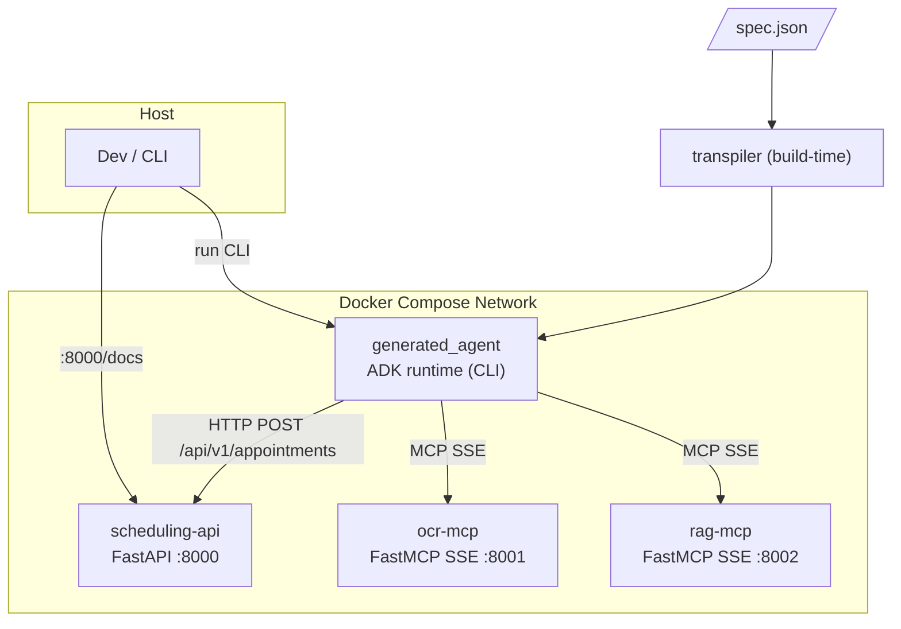
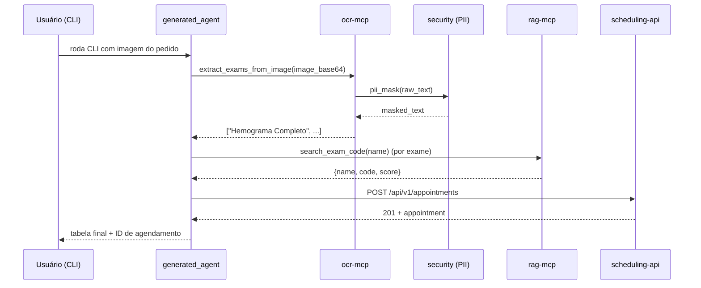

# Arquitetura-alvo

Documento vivo. Atualizado sempre que um contrato público entre subsistemas mudar.

## Visão geral

Cinco serviços rodando em rede Docker Compose, mais dois artefatos fora do runtime (transpilador + agente gerado).



## Serviços

### `transpiler` (build-time, não é container)
- Entrada: `spec.json` validado contra Pydantic `AgentSpec`.
- Saída: pacote Python `generated_agent/` pronto para ser usado via `adk run` ou importado pelo container do agente.
- Interface: `python -m transpiler <spec.json> -o ./generated_agent`.
- Determinístico (mesmo input → mesmo output).

### `ocr-mcp`
- Tecnologia: FastMCP + SSE (`mcp.run(transport="sse", port=8001)`).
- MVP: mock determinístico — dado um hash da imagem, retorna texto canned de um dicionário de fixtures.
- **Camada PII aplicada aqui** antes de retornar (`security.pii_mask(text)`).
- Tools expostas: `extract_exams_from_image(image_base64: str) -> list[str]`.

### `rag-mcp`
- Tecnologia: FastMCP + SSE em `:8002`.
- Catálogo mock de **≥ 100 exames** (nome + código) em memória; busca por similaridade simples (e.g., fuzzy match sobre nome).
- Tools expostas: `search_exam_code(exam_name: str) -> dict` (campos: `name`, `code`, `score`), `list_exams() -> list[dict]`.

### `scheduling-api`
- Tecnologia: FastAPI + Pydantic v2 + Uvicorn em `:8000`.
- Endpoints:
  - `POST /api/v1/appointments` → cria.
  - `GET  /api/v1/appointments/{id}` → lê.
  - `GET  /api/v1/appointments` → lista (paginação simples).
  - `GET  /health` → healthcheck.
- Swagger em `/docs`.
- Armazenamento: in-memory dict atrás de uma interface (trocável).
- **Nunca** recebe PII — a anonimização ocorre upstream.

### `generated_agent`
- Pacote Python gerado pelo transpilador, conforme estrutura ADK:
  ```
  generated_agent/
  ├── __init__.py       # import agent
  ├── agent.py          # root_agent
  ├── requirements.txt
  ├── Dockerfile
  └── .env.example
  ```
- `root_agent = LlmAgent(...)` com `MCPToolset(SseConnectionParams(...))` para OCR e RAG, e OpenAPI toolset (ou HTTP client simples) para a API de agendamento.
- `before_model_callback` aplica PII guard como segunda linha de defesa.

## Contratos entre subsistemas

### OCR MCP → Agente
```jsonc
// tool: extract_exams_from_image
// input
{"image_base64": "<str>"}
// output
["Hemograma Completo", "Glicemia de Jejum", ...]
```
A saída é texto **já mascarado** de PII.

### RAG MCP → Agente
```jsonc
// tool: search_exam_code
// input
{"exam_name": "Hemograma Completo"}
// output
{"name": "Hemograma Completo", "code": "HMG-001", "score": 0.98}
```

### Agente → Scheduling API
```jsonc
// POST /api/v1/appointments
{
  "patient_ref": "anon-abc123",
  "exams": [{"name": "Hemograma Completo", "code": "HMG-001"}],
  "scheduled_for": "2026-05-01T09:00:00Z",
  "notes": null
}
// 201 Created
{
  "id": "apt-42",
  "status": "scheduled",
  "created_at": "2026-04-18T12:00:00Z",
  "patient_ref": "anon-abc123",
  "exams": [...],
  "scheduled_for": "2026-05-01T09:00:00Z"
}
```

### PII Guard (módulo `security/`)
```python
def pii_mask(text: str, language: str = "pt") -> MaskedResult:
    """
    Returns MaskedResult(masked_text: str, entities: list[EntityHit]).
    entities carry only entity_type, start, end, score, and sha256_prefix — never raw values.
    """
```

## Variáveis de ambiente (consolidadas)

| Variável | Quem usa | Exemplo |
|---|---|---|
| `GOOGLE_GENAI_USE_VERTEXAI` | generated_agent | `FALSE` |
| `GOOGLE_API_KEY` | generated_agent | `AIza...` |
| `OCR_MCP_URL` | generated_agent | `http://ocr-mcp:8001/sse` |
| `RAG_MCP_URL` | generated_agent | `http://rag-mcp:8002/sse` |
| `SCHEDULING_API_URL` | generated_agent | `http://scheduling-api:8000` |
| `PII_DEFAULT_LANGUAGE` | security | `pt` |
| `LOG_LEVEL` | todos | `INFO` |

Detalhes em `.env.example`.

## Decisões principais

Registradas em `docs/adr/`:

- ADR-0001 — *a definir* — escolha do transporte MCP (SSE, conforme exigido).
- ADR-0002 — *a definir* — abordagem do transpilador (Jinja2 + `ast.parse`).
- ADR-0003 — *a definir* — camada dupla de PII (OCR + `before_model_callback`).

## Diagrama de fluxo (pedido médico)


