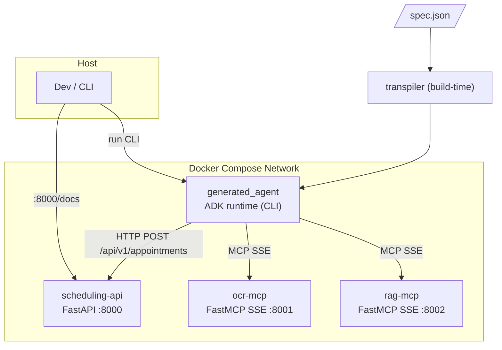
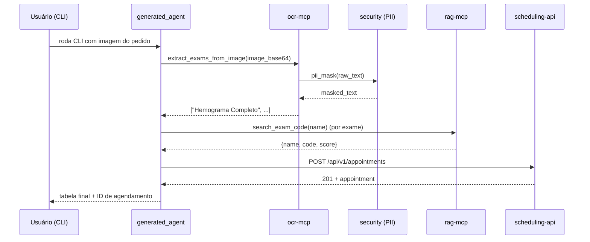

# Arquitetura-alvo

Documento vivo. Atualizado sempre que um contrato público entre subsistemas mudar.

## Visão geral

Cinco serviços rodando em rede Docker Compose, mais dois artefatos fora do runtime (transpilador + agente gerado).



## Serviços

### `transpiler` (build-time, não é container)
- Entrada: `spec.json` validado contra Pydantic `AgentSpec`.
- Saída: pacote Python `generated_agent/` pronto para ser usado via `adk run` ou importado pelo container do agente.
- Interface: `python -m transpiler <spec.json> -o ./generated_agent`.
- Determinístico (mesmo input → mesmo output).

### `ocr-mcp`
- Tecnologia: FastMCP + SSE (`mcp.run(transport="sse", port=8001)`).
- **OCR real via Tesseract** (spec 0011 / ADR-0011): `pytesseract.image_to_string(img, lang="por")` com binário `tesseract-ocr` + `tesseract-ocr-por` instalado no Dockerfile. Módulo `ocr_mcp/ocr.py` encapsula a chamada em `asyncio.to_thread` + filtro de ruído (header blacklist, min-len 5 com exemption para acrônimos médicos, cap 64 linhas).
- **Fast-path de hash** (`ocr_mcp/fixtures.py`): preservado como cache zero-latência. `lookup(image_base64) -> list[str] | None` retorna lista canned para hashes conhecidos ou `None` (miss) → delega ao Tesseract. Contrato público da tool MCP inalterado (AC8).
- **Camada PII aplicada aqui** antes de retornar (`security.pii_mask(text)`), tanto no fast-path quanto no caminho Tesseract.
- Tools expostas: `extract_exams_from_image(image_base64: str) -> list[str]`.
- Envs: `OCR_TESSERACT_LANG` (default `por`) controla o Tesseract; `OCR_DEFAULT_LANGUAGE` (default `pt`) controla o Presidio — separados em spec 0011.

### `rag-mcp`
- Tecnologia: FastMCP + SSE em `:8002`.
- Catálogo mock de **≥ 100 exames** (nome + código) em memória; busca por similaridade simples (e.g., fuzzy match sobre nome).
- Tools expostas: `search_exam_code(exam_name: str) -> dict` (campos: `name`, `code`, `score`), `list_exams() -> list[dict]`.

### `scheduling-api`
- Tecnologia: FastAPI + Pydantic v2 + Uvicorn em `:8000`.
- Endpoints:
  - `POST /api/v1/appointments` → cria.
  - `GET  /api/v1/appointments/{id}` → lê.
  - `GET  /api/v1/appointments` → lista (paginação simples).
  - `GET  /health` → healthcheck.
- Swagger em `/docs`.
- Armazenamento: in-memory dict atrás de uma interface (trocável).
- **Nunca** recebe PII — a anonimização ocorre upstream.

### `generated_agent`
- Pacote Python gerado pelo transpilador, conforme estrutura ADK:
  ```
  generated_agent/
  ├── __init__.py       # import agent
  ├── agent.py          # root_agent
  ├── requirements.txt
  ├── Dockerfile
  └── .env.example
  ```
- `root_agent = LlmAgent(...)` com `McpToolset(connection_params=SseConnectionParams(url=...))` para OCR e RAG (servidores FastMCP rodam `transport="sse"`; `SseConnectionParams` é a classe cliente correta no ADK — ver ADR-0001 § Correção da correção 2026-04-19), e OpenAPI toolset (ou HTTP client simples) para a API de agendamento.
- `before_model_callback` aplica PII guard como segunda linha de defesa.

## Contratos entre subsistemas

### OCR MCP → Agente
```jsonc
// tool: extract_exams_from_image
// input
{"image_base64": "<str>"}
// output
["Hemograma Completo", "Glicemia de Jejum", ...]
```
A saída é texto **já mascarado** de PII.

### RAG MCP → Agente
```jsonc
// tool: search_exam_code
// input
{"exam_name": "Hemograma Completo"}
// output
{"name": "Hemograma Completo", "code": "HMG-001", "score": 0.98}
```

### Agente → Scheduling API
```jsonc
// POST /api/v1/appointments
{
  "patient_ref": "anon-abc123",
  "exams": [{"name": "Hemograma Completo", "code": "HMG-001"}],
  "scheduled_for": "2026-05-01T09:00:00Z",
  "notes": null
}
// 201 Created
{
  "id": "apt-42",
  "status": "scheduled",
  "created_at": "2026-04-18T12:00:00Z",
  "patient_ref": "anon-abc123",
  "exams": [...],
  "scheduled_for": "2026-05-01T09:00:00Z"
}
```

### PII Guard (módulo `security/`)
```python
def pii_mask(text: str, language: str = "pt") -> MaskedResult:
    """
    Returns MaskedResult(masked_text: str, entities: list[EntityHit]).
    entities carry only entity_type, start, end, score, and sha256_prefix — never raw values.
    """
```

## Variáveis de ambiente (consolidadas)

A superfície completa de configuração (26 variáveis de runtime + 7 do transpilador) é documentada em [`docs/CONFIGURATION.md`](CONFIGURATION.md) e formalizada pela [ADR-0009](adr/0009-runtime-config-via-env.md). O princípio é "spec define o default, `.env` sobrescreve em runtime para todo parâmetro com legitimidade operacional"; contratos públicos e calibrações Presidio por-recognizer permanecem hardcoded.

Tabela resumida — apenas as variáveis mais usadas no runbook:

| Variável | Quem usa | Default | Observação |
|---|---|---|---|
| `GOOGLE_API_KEY` | generated_agent | *(sem default)* | Obrigatória. |
| `GOOGLE_GENAI_USE_VERTEXAI` | generated_agent | `FALSE` | Gemini direct vs. Vertex. |
| `GEMINI_MODEL` | generated_agent | `gemini-2.5-flash-lite` | Troca de modelo sem rebuild (motivador da ADR-0009 — incidente 503 de 2026-04-20). |
| `OCR_MCP_URL` | generated_agent | `http://ocr-mcp:8001/sse` | DNS do compose; evite `localhost`. |
| `RAG_MCP_URL` | generated_agent | `http://rag-mcp:8002/sse` | Idem. |
| `SCHEDULING_OPENAPI_URL` | generated_agent | `http://scheduling-api:8000/openapi.json` | Idem. |
| `RAG_FUZZY_THRESHOLD` | rag_mcp | `80` | Precisão/recall do match fuzzy. |
| `PII_SCORE_THRESHOLD` | security | `0.5` | Dial global de FP/FN do Presidio. |
| `PII_SPACY_MODEL_PT` | security + Dockerfiles | `pt_core_news_lg` | **Build-arg** — exige `docker compose build` para re-bake. |
| `LOG_LEVEL` | todos | `INFO` | Observabilidade. |

Tabela completa, agrupada por serviço, com impacto e arquivo fonte de cada variável, está em [`docs/CONFIGURATION.md`](CONFIGURATION.md). Superfície exata em `.env.example`.

## Schema Pydantic do JSON spec

Congelado pela [ADR-0006](adr/0006-spec-schema-and-agent-topology.md). Qualquer campo novo exige nova ADR supersedendo.

```python
from typing import Literal
from pydantic import BaseModel, Field


class McpServerSpec(BaseModel):
    name: str
    url: str                                # ex.: http://ocr-mcp:8001/sse
    tool_filter: list[str] | None = None    # None = todas as tools


class HttpToolSpec(BaseModel):
    name: str
    base_url: str                           # ex.: http://scheduling-api:8000
    openapi_url: str | None = None          # opcional: gerar tools a partir de OpenAPI


class PiiGuardSpec(BaseModel):
    enabled: bool = True
    allow_list: list[str] = []


class GuardrailSpec(BaseModel):
    pii: PiiGuardSpec = Field(default_factory=PiiGuardSpec)


class AgentSpec(BaseModel):
    name: str = Field(pattern=r"^[a-z0-9][a-z0-9-]*$")
    description: str
    model: Literal["gemini-2.5-flash", "gemini-2.5-flash-lite"]  # ampliado por ADR-0009; runtime override via GEMINI_MODEL env
    instruction: str                         # prompt multiline, imperativo
    mcp_servers: list[McpServerSpec]
    http_tools: list[HttpToolSpec]
    guardrails: GuardrailSpec = Field(default_factory=GuardrailSpec)
```

Exemplo mínimo (`spec.example.json`):

```json
{
  "name": "medical-order-agent",
  "description": "Agente de agendamento de exames a partir de pedidos médicos",
  "model": "gemini-2.5-flash-lite",
  "instruction": "Você recebe uma imagem...",
  "mcp_servers": [
    {"name": "ocr", "url": "http://ocr-mcp:8001/sse"},
    {"name": "rag", "url": "http://rag-mcp:8002/sse"}
  ],
  "http_tools": [
    {"name": "scheduling", "base_url": "http://scheduling-api:8000", "openapi_url": "http://scheduling-api:8000/openapi.json"}
  ],
  "guardrails": {"pii": {"enabled": true, "allow_list": []}}
}
```

## Assinaturas exatas das tools MCP

Congeladas pelas [ADR-0001](adr/0001-mcp-transport-sse.md) e [ADR-0007](adr/0007-rag-fuzzy-and-catalog.md).

### `ocr-mcp`

```python
@mcp.tool()
def extract_exams_from_image(image_base64: str) -> list[str]:
    """
    Recebe imagem em base64 do pedido médico, retorna lista de nomes de exames.
    A saída passa por security.pii_mask() antes de retornar.
    """
```

### `rag-mcp`

```python
class ExamMatch(BaseModel):
    name: str
    code: str
    score: float   # 0..1 (rapidfuzz /100)

class ExamSummary(BaseModel):
    name: str
    code: str

@mcp.tool()
def search_exam_code(exam_name: str) -> ExamMatch | None:
    """
    Fuzzy match contra catálogo. Threshold 80 (rapidfuzz escala 0-100).
    Retorna None quando nenhum candidato atinge o threshold.
    """

@mcp.tool()
def list_exams(limit: int = 100) -> list[ExamSummary]:
    """Catálogo paginado, útil para fallback quando search_exam_code retorna None."""
```

## Catálogo de exames (CSV)

Formato congelado pela [ADR-0007](adr/0007-rag-fuzzy-and-catalog.md).

- Arquivo: `rag_mcp/data/exams.csv`, UTF-8, separador `,`.
- Header obrigatório na primeira linha.
- Colunas na ordem: `name,code,category,aliases`.
  - `aliases` é lista separada por `|` (ex.: `Hemograma|HMG|HMC`).
- Comentários com `#` **não** são aceitos; use o README do diretório.

## Lista definitiva de entidades PII

Motor: Microsoft Presidio com recognizers BR **escritos neste projeto** (Presidio não oferece reconhecedores brasileiros nativos — ver ADR-0003 nota de correção). Congelado pela [ADR-0003](adr/0003-pii-double-layer.md). Aplicação dupla: dentro do `ocr-mcp` (linha 1) e via `before_model_callback` do agente (linha 2).

| Entidade | Origem | Ação | Placeholder |
|---|---|---|---|
| `BR_CPF` | custom recognizer (regex + dígito verificador via `pycpfcnpj`) | replace | `<CPF>` |
| `BR_CNPJ` | custom recognizer (regex + dígito verificador via `pycpfcnpj`) | replace | `<CNPJ>` |
| `BR_RG` | custom recognizer (regex por UF mais comum) | replace | `<RG>` |
| `BR_PHONE` | custom recognizer (regex DDD+9 dígitos BR) | replace | `<PHONE>` |
| `PERSON` | Presidio stock | replace | `<PERSON>` |
| `EMAIL_ADDRESS` | Presidio stock | replace | `<EMAIL>` |
| `PHONE_NUMBER` | Presidio stock | replace | `<PHONE>` |
| `LOCATION` | Presidio stock | replace | `<LOCATION>` |
| `DATE_TIME` | Presidio stock | **não mascarar** | — (datas clínicas são relevantes) |

Allow-list padrão: nomes canônicos do catálogo RAG + termos médicos comuns (`hemograma`, `glicemia`, etc.). Configurável via `guardrails.pii.allow_list` no spec.

O detector retorna `MaskedResult(masked_text, entities)`. `entities` traz apenas `entity_type`, `start`, `end`, `score`, `sha256_prefix` — **nunca** valores crus.

## Taxonomia de erros

Cada módulo define uma exceção-base e códigos estáveis. Códigos **não** são reaproveitados. Mensagens são em PT-BR para usuário final; logs carregam código + detalhes técnicos em EN.

| Código | Módulo | Quando | Sugestão ao usuário |
|---|---|---|---|
| `E_TRANSPILER_SCHEMA` | transpiler | JSON spec não valida contra `AgentSpec` | "Verifique o arquivo spec.json contra o schema em docs/ARCHITECTURE.md" |
| `E_TRANSPILER_RENDER` | transpiler | Erro ao renderizar template Jinja2 | "Abra issue — template corrompido" |
| `E_TRANSPILER_SYNTAX` | transpiler | `ast.parse` rejeita saída | "Abra issue — transpilador produziu código inválido" |
| `E_PII_ENGINE` | security | Presidio falha ao inicializar | "Verifique dependências de `security/`" |
| `E_PII_LANGUAGE` | security | Idioma não suportado | "Use `pt` ou `en`" |
| `E_MCP_TIMEOUT` | generated_agent | Servidor MCP não respondeu em N s | "Verifique se o serviço subiu (`docker compose ps`)" |
| `E_MCP_TOOL_NOT_FOUND` | generated_agent | Tool não existe no servidor | "Verifique `tool_filter` no spec" |
| `E_API_NOT_FOUND` | scheduling_api | Recurso não existe | "Confirme o ID do agendamento" |
| `E_API_VALIDATION` | scheduling_api | Body/query inválidos | Mensagem Pydantic com campo + motivo |
| `E_RAG_NO_MATCH` | rag_mcp | Nenhum candidato ≥ threshold | Lista top-5 candidatos como sugestão |

Toda exceção propagada herda de `ChallengeError(Exception)` com atributos `code: str`, `message: str`, `hint: str | None`.

## Robustez e guardrails

Política cross-service congelada em [ADR-0008](adr/0008-robust-validation-policy.md). Esta seção **instancia** as tabelas normativas — caps, timeouts, shape de erro — para consulta rápida pelos engenheiros de bloco. Divergência entre este documento e ADR-0008 é bug de processo e resolve-se primeiro na ADR, depois aqui.

### Códigos de erro consolidados

Tabela-mestre `E_*`. Reuso proibido. Novo código exige PR que atualize esta tabela + ADR-0008 antes do uso em código.

| Código | Módulo dono | Condição disparadora | Mensagem canônica (PT-BR) | Hint |
|---|---|---|---|---|
| `E_TRANSPILER_SCHEMA` | transpiler | `spec.json` não valida contra `AgentSpec`; campos fora do schema; caps de lista/string estourados | "Campo `<path>` inválido: `<motivo>`" | "Verifique o arquivo `spec.json` contra `docs/ARCHITECTURE.md § Schema Pydantic`" |
| `E_TRANSPILER_RENDER` | transpiler | Erro ao renderizar template Jinja2; `output_dir` fora do projeto | "Falha ao renderizar `<template>`" | "Inspecione `output_dir` e template" |
| `E_TRANSPILER_RENDER_SIZE` | transpiler | Arquivo gerado > 100 KB (ex.: `agent.py` patológico) | "Arquivo gerado excede 100 KB" | "Revise o spec — instruction ou listas de tools grandes demais" |
| `E_TRANSPILER_SYNTAX` | transpiler | `ast.parse` rejeita saída do template | "Template produziu Python inválido em `<file>`" | "Abra issue — transpilador produziu código inválido" |
| `E_OCR_IMAGE_TOO_LARGE` | ocr_mcp | `image_base64` decoded > 5 MB | "Imagem > 5 MB não suportada" | "Comprima ou reduza a imagem antes de enviar" |
| `E_OCR_INVALID_INPUT` | ocr_mcp | `image_base64` não é base64 válido | "`image_base64` não é base64 válido" | "Codifique a imagem em base64 padrão (RFC 4648)" |
| `E_OCR_TIMEOUT` | ocr_mcp | OCR tool call > 5 s | "OCR não respondeu em 5 s" | "Verifique se `ocr-mcp` está saudável (`docker compose ps`)" |
| `E_RAG_NO_MATCH` | rag_mcp | Nenhum candidato ≥ threshold 80/100 (rapidfuzz) | "Nenhum match ≥ 80% para `<exam_name>`" | "Veja `list_exams(limit=5)` para sugestões próximas" |
| `E_RAG_QUERY_TOO_LARGE` | rag_mcp | Query `exam_name` > 500 chars | "`exam_name` excede 500 chars" | "Envie apenas o nome do exame, sem contexto extra" |
| `E_RAG_QUERY_EMPTY` | rag_mcp | Query vazia ou só whitespace após `.strip()` | "`exam_name` está vazia" | "Envie o nome do exame" |
| `E_RAG_TIMEOUT` | rag_mcp | RAG tool call > 2 s | "RAG não respondeu em 2 s" | "Verifique se `rag-mcp` está saudável" |
| `E_CATALOG_LOAD_FAILED` | rag_mcp | CSV com BOM, linha em branco, encoding não-UTF-8, `code` duplicado | "Falha ao carregar catálogo: `<detalhe>` na linha `<N>`" | "Inspecione `rag_mcp/data/exams.csv`" |
| `E_PII_ENGINE` | security | Presidio / spaCy falha ao inicializar | "Motor PII não inicializou" | "Verifique dependências: `uv run python -m spacy download pt_core_news_lg`" |
| `E_PII_LANGUAGE` | security | Idioma fora de `{pt, en}` | "Idioma `<lang>` não suportado" | "Use `pt` ou `en`" |
| `E_PII_TEXT_SIZE` | security | `text` > 100 KB em `pii_mask` | "Texto excede 100 KB" | "Divida em chunks menores ou reduza o input" |
| `E_PII_ALLOW_LIST_SIZE` | security | `allow_list` > 1000 itens | "`allow_list` excede 1000 itens" | "Revise a lista — use categorias canônicas" |
| `E_PII_TIMEOUT` | security | `pii_mask` excede 5 s de processamento | "`pii_mask` excedeu 5 s" | "Divida o texto em chunks menores; verifique saúde do motor Presidio" |
| `E_API_NOT_FOUND` | scheduling_api | Recurso não existe (GET /{id}) | "Agendamento `<id>` não encontrado" | "Confirme o ID" |
| `E_API_VALIDATION` | scheduling_api | Body/query inválido; `patient_ref` fora do pattern; `exams[]` vazio/duplicado; `scheduled_for` no passado/naive; caps | "Campo `<path>` inválido: `<motivo>`" | "Consulte `/docs` para o contrato" |
| `E_API_TIMEOUT` | scheduling_api | Request > 10 s | "API não respondeu em 10 s" | "Verifique se `scheduling-api` está saudável" |
| `E_API_PAYLOAD_TOO_LARGE` | scheduling_api | HTTP body `Content-Length` > 256 KB (middleware borda) | "Body excede o limite de 256 KB" | "Reduza o tamanho do payload" |
| `E_API_INTERNAL` | scheduling_api | Erro interno não classificado (catch-all 500, `HTTPException` não-422 sem código domínio) | "Erro interno do servidor" | "Verifique os logs do serviço" |
| `E_MCP_TIMEOUT` | generated_agent | MCP tool call > timeout do serviço (ver tabela Timeouts) | "MCP `<server>` não respondeu no timeout" | "Verifique se o serviço subiu (`docker compose ps`)" |
| `E_MCP_TOOL_NOT_FOUND` | generated_agent | Tool inexistente no servidor | "Tool `<name>` não existe em `<server>`" | "Verifique `tool_filter` no spec" |
| `E_MCP_UNAVAILABLE` | generated_agent | Pré-OCR CLI não conseguiu abrir conexão SSE com `ocr-mcp` após `PREOCR_MCP_CONNECT_RETRIES` tentativas. Exit code 5. ADR-0010. | "OCR MCP indisponível após `<N>` tentativa(s)" | "Verifique se `ocr-mcp` está saudável (`docker compose ps`)" |
| `E_OCR_UNKNOWN_IMAGE` | generated_agent | Pré-OCR CLI retornou lista de exames vazia (ou timeout do pré-OCR). Exit code 4. ADR-0010. | "OCR pré-executado não reconheceu a imagem" | "Verifique se a imagem tem um pedido médico legível; registre-a em `ocr_mcp/fixtures.py` se for nova" |
| `E_AGENT_TIMEOUT` | generated_agent | Execução total do agente > 300 s | "Agente excedeu 300 s" | "Inspecione logs; reinicie stack" |
| `E_AGENT_INPUT_NOT_FOUND` | generated_agent | 1 (CLI) | "Arquivo de entrada não encontrado" | "Verifique o caminho do --image" | input validation at CLI boot |
| `E_AGENT_OUTPUT_INVALID` | generated_agent | LLM retorna resposta não-estruturada após a tabela ASCII esperada | "Saída do agente não conforme esperado" | "Revise `instruction`; inspecione `response_id` nos logs" |

### Shape canônico da resposta de erro

Toda exceção `ChallengeError` serializa para:

```json
{
  "code": "E_API_VALIDATION",
  "message": "patient_ref inválido",
  "hint": "Use padrão ^anon-[a-z0-9]+$",
  "path": "body.patient_ref",
  "context": {"received": "João Silva", "expected_pattern": "^anon-..."}
}
```

Variantes por transporte:

- **HTTP** (FastAPI 4xx/5xx body): `{"error": {<shape>}, "correlation_id": "<uuid>"}`.
- **CLI** (transpilador, agente): shape impresso em stderr (uma linha por campo); exit code ≠ 0 conforme categoria (1 schema, 2 render, 3 syntax, etc.).
- **Log JSON**: shape + `timestamp`, `service`, `correlation_id`, `event=error.raised`.

`hint` obrigatório quando o usuário consegue agir. `context` **nunca** carrega PII crua — apenas `entity_type`, `expected_pattern`, `sha256_prefix`, métricas.

### Guardrails de tamanho

| Alvo | Cap | Código em violação |
|---|---|---|
| `image_base64` decoded | 5 MB | `E_OCR_IMAGE_TOO_LARGE` |
| `text` em `pii_mask` | 100 KB | `E_PII_TEXT_SIZE` |
| `exam_name` query RAG | 500 chars | `E_RAG_QUERY_TOO_LARGE` |
| `mcp_servers[]` (spec) | 10 itens | `E_TRANSPILER_SCHEMA` |
| `http_tools[]` (spec) | 20 itens | `E_TRANSPILER_SCHEMA` |
| `tool_filter[]` (spec) | 50 itens | `E_TRANSPILER_SCHEMA` |
| `name`, `description`, `instruction` | 500 chars | `E_TRANSPILER_SCHEMA` |
| URL em `url`, `base_url`, `openapi_url` | 2048 chars | `E_TRANSPILER_SCHEMA` |
| `patient_ref` (API) | 64 chars | `E_API_VALIDATION` |
| `exams[]` no POST | 20 itens | `E_API_VALIDATION` |
| `spec.json` total | 1 MB | `E_TRANSPILER_SCHEMA` |
| `agent.py` gerado | 100 KB | `E_TRANSPILER_RENDER_SIZE` |
| HTTP body POST | 256 KB (middleware `BodySizeLimitMiddleware`) | `E_API_PAYLOAD_TOO_LARGE` |
| `allow_list` (PII) | 1000 itens | `E_PII_ALLOW_LIST_SIZE` |

Caps são verificados **na borda** — antes de decodificar, parsear ou invocar motor pesado.

### Timeouts de falha

| Operação | Timeout | Código em violação |
|---|---|---|
| OCR tool call | 5 s | `E_OCR_TIMEOUT` |
| RAG tool call | 2 s | `E_RAG_TIMEOUT` |
| POST `/api/v1/appointments` | 10 s | `E_API_TIMEOUT` |
| PII mask (`pii_mask`) | 5 s | `E_PII_TIMEOUT` |
| Agente total (execução) | 300 s (5 min) | `E_AGENT_TIMEOUT` |
| Healthcheck HTTP (compose) | 30 s total | timeout do compose |
| Retry MCP (ADR-0006) | 1 tentativa, delay fixo 500 ms | — |

Timeout é **contrato de falha**, diferente de latência p95 (métrica NFR). Os dois coexistem.

### Correlation ID

- **Origem**: CLI do agente gera UUID v4 no início da execução.
- **Propagação HTTP**: header `X-Correlation-ID` em todas as chamadas (OCR, RAG, API).
- **Propagação MCP**: metadata/contexto quando disponível; fallback local `mcp-<uuid4>[:8]`.
- **Eco**: `scheduling-api` gera `api-<uuid4>[:8]` se a request vier sem header e devolve no response.
- **Logs**: 100 % dos registros JSON têm `correlation_id`. Auditável por grep.

### Logging sem PII crua

Nenhum log contém valor cru detectado como entidade PII. Formato canônico para referenciar dado mascarado:

```json
{"entity_type": "BR_CPF", "sha256_prefix": "a1b2c3d4", "score": 0.95}
```

Auditoria: E2E (Bloco 0008 AC15) grepa fixtures de CPF/nome em todos os arquivos sob `docs/EVIDENCE/` e deve retornar zero matches.

## Formato de log

Logging estruturado em JSON via `logging` stdlib + formatter custom. Um registro por linha, `stdout` (compose captura).

Campos obrigatórios:

```json
{
  "ts": "2026-04-18T12:00:00.123Z",
  "level": "INFO",
  "service": "ocr-mcp",
  "correlation_id": "c-abc123",
  "event": "tool.called",
  "message": "extract_exams_from_image ok",
  "extra": {"tool": "extract_exams_from_image", "duration_ms": 42}
}
```

- `correlation_id` nasce na CLI do agente, propaga via header `X-Correlation-ID` em HTTP e via metadata/contexto no MCP.
- `event` segue dot.notation: `tool.called`, `tool.failed`, `http.request`, `pii.masked`, `transpiler.parsed`.
- `extra` é livre, mas **nunca** contém PII crua — apenas prefixos sha256 ou contadores.

## Classificação das tools

Seguindo a taxonomia de Chip Huyen (*AI Engineering*, cap. 6) — útil para discutir risco, cache e auditoria:

| Tool | Categoria | Observações |
|---|---|---|
| `extract_exams_from_image` (ocr-mcp) | **knowledge** (leitura) | Lê pedido médico. PII mascarada na saída. Idempotente. |
| `search_exam_code` / `list_exams` (rag-mcp) | **knowledge** (leitura) | Consulta catálogo estático. Sem efeitos colaterais. |
| `POST /api/v1/appointments` (scheduling-api) | **write-action** | Única tool com efeito colateral observável pelo mundo. Toda chamada gera log `event=http.request` com `correlation_id` + hash do payload. |
| `GET /api/v1/appointments/...` (scheduling-api) | **knowledge** | Listagem/leitura, seguras para retry. |

Implicação operacional: só uma tool (`POST /appointments`) muda estado. Isso delimita o raio de explosão de um prompt-injection bem-sucedido — o agente gerado não pode enviar e-mail, deletar arquivo, executar código arbitrário. Reforça a escolha de PII em dupla camada (ADR-0003) e dispensa um "human-in-the-loop approval" para cada write no MVP (Huyen recomenda para agentes com múltiplas writes heterogêneas — não é nosso caso).

## Camadas conscientemente omitidas

A plataforma GenAI que Chip Huyen descreve (*AI Engineering*, cap. 10) tem seis camadas: Context, Guardrails, Router, Cache, Logic, Observability. Adotamos quatro; rejeitamos duas:

- **Router / gateway de modelos** — não adotado. Temos **um** modelo (`gemini-2.5-flash`, ADR-0005). Router faz sentido quando roteia entre Gemini/OpenAI/Claude por custo ou especialidade; para este desafio seria complexidade sem retorno. Consequência: modelo fixado via `Literal` no schema; trocar exige ADR nova.
- **Cache semântico** — não adotado. O RAG já é determinístico (catálogo estático + rapidfuzz) e o OCR usa Tesseract local (spec 0011), sem custo por chamada. Cache de chamadas LLM exigiria camada extra sem ganho mensurável no MVP; pode virar ADR nova se a avaliação exigir métrica de latência.

As outras quatro camadas estão presentes: **Context** (MCP servers), **Guardrails** (PII dupla camada + validação Pydantic), **Logic** (LlmAgent único, ADR-0006), **Observability** (logs estruturados JSON com `correlation_id`).

## Decisões principais

Registradas em [`docs/adr/`](adr/README.md):

- [ADR-0001](adr/0001-mcp-transport-sse.md) — Transporte MCP via SSE.
- [ADR-0002](adr/0002-transpiler-jinja-ast.md) — Transpilador via Jinja2 + `ast.parse` como gate.
- [ADR-0003](adr/0003-pii-double-layer.md) — PII mascarada em dupla camada (OCR + `before_model_callback`).
- [ADR-0004](adr/0004-sdd-tdd-workflow.md) — Workflow SDD + TDD pragmático.
- [ADR-0005](adr/0005-dev-stack.md) — Stack de desenvolvimento (uv + Gemini + GitHub Actions).
- [ADR-0006](adr/0006-spec-schema-and-agent-topology.md) — Schema do JSON spec + topologia LlmAgent único.
- [ADR-0007](adr/0007-rag-fuzzy-and-catalog.md) — RAG MCP via rapidfuzz + catálogo CSV.
- [ADR-0008](adr/0008-robust-validation-policy.md) — Robustez de validação: taxonomia de erros, guardrails e shape de resposta.
- [ADR-0009](adr/0009-runtime-config-via-env.md) — Configuração de runtime via variáveis de ambiente (parcial supersede de ADR-0006 no escopo do campo `model`).

## Diagrama de fluxo (pedido médico)


