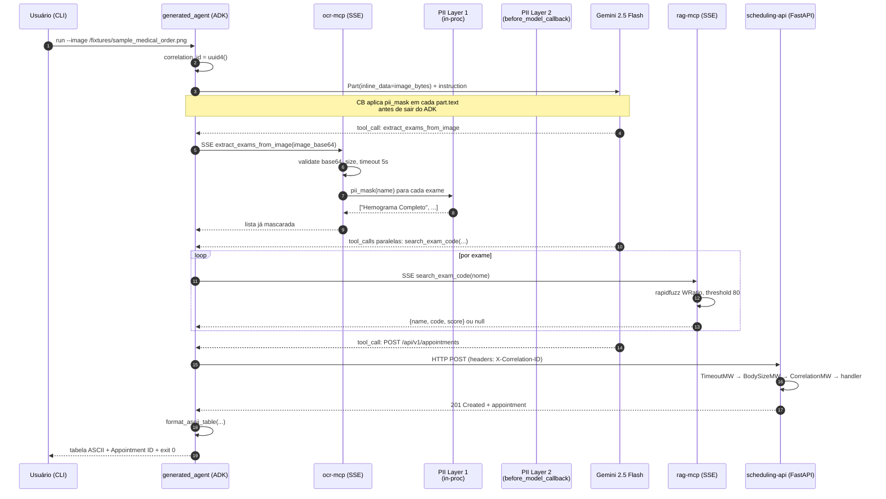

# Walkthrough — Como o agente funciona na prática

Documento narrativo voltado ao avaliador humano. Complementa [`docs/ARCHITECTURE.md`](ARCHITECTURE.md) (estrutura estática e contratos) com a dimensão temporal: o que acontece, na ordem em que acontece, quando o usuário invoca o agente gerado com uma imagem de pedido médico.

Para ir direto ao código, os arquivos-âncora são `generated_agent/__main__.py` (CLI), `generated_agent/agent.py` (montagem do `LlmAgent`), `ocr_mcp/ocr_mcp/server.py` (OCR MCP + PII Layer 1), `security/security/callback.py` (PII Layer 2) e `scheduling_api/scheduling_api/app.py` (API com middlewares).

---

## 1. Visão geral

O sistema é um agente ADK orquestrando três ferramentas remotas: um servidor MCP de OCR (SSE), um servidor MCP de RAG (SSE) e uma API FastAPI de agendamento (HTTP/OpenAPI). O fluxo é `plan-then-execute` fixo: OCR uma vez, RAG em paralelo por exame, um único `POST /appointments`, e então a tabela ASCII final. PII é mascarada em duas camadas (dentro do servidor OCR e novamente antes do prompt chegar ao Gemini).

```
+---------+      +---------+     +------------+      +-------------+
|  CLI    | ---> | OCR MCP | --> | PII Layer 1| -----> Gemini 2.5 |
| (user)  |      |  (SSE)  |     |  (in-proc) |      |   Flash     |
+---------+      +---------+     +------------+      +------+------+
                                                             |
                                            (PII Layer 2: before_model_callback)
                                                             |
                                                             v
                                  +---------+          +-------------+
                                  | RAG MCP | <------> | FastAPI     |
                                  |  (SSE)  |          | scheduling  |
                                  +---------+          +-------------+
```

---

## 2. Passo 1 — Entrada

O avaliador invoca a CLI do container `generated-agent`:

```
docker compose run --rm generated-agent --image /fixtures/sample_medical_order.png
```

O caminho `/fixtures/...` é montado no container a partir de `./docs/fixtures/` do host, em modo somente-leitura, conforme o `docker-compose.yml`. A fixture `sample_medical_order.png` é um PNG sintético: não contém dado real, e sua utilidade é ter um hash SHA-256 determinístico que o OCR mock reconhece (ver Passo 2).

O ponto de entrada é `generated_agent/__main__.py::main()`. Ele:

1. Configura logging estruturado JSON (`configure_logging()`).
2. Faz parse do único argumento aceito — `--image` (o `--spec` foi removido pelo code-reviewer; ver [0006-generated-agent.md](EVIDENCE/0006-generated-agent.md)).
3. Gera um `correlation_id = str(uuid.uuid4())`. Esse UUID é a linha de costura de toda a execução: vai como header `X-Correlation-ID` em cada chamada HTTP e SSE e aparece em todo log JSON.
4. Verifica se o arquivo existe com `os.path.isfile`. Ausente, a CLI emite o envelope canônico `{"error": {"code": "E_AGENT_INPUT_NOT_FOUND", ...}, "correlation_id": ...}` em `stderr` e sai com código 1.
5. Lê os bytes da imagem e infere o mime-type via `mimetypes.guess_type(image_path)` (fallback `image/png`).

A partir daqui, tudo acontece dentro de `asyncio.wait_for(_run_agent(...), timeout=300)`. Qualquer passo posterior que ultrapasse cinco minutos é preemptado com `E_AGENT_TIMEOUT`, exit code 2.

---

## 3. Passo 2 — OCR via MCP (SSE) + PII Layer 1

`_run_agent()` constrói o `LlmAgent` chamando `agent._build_agent(correlation_id)`. Nessa função, o `McpToolset` do ADK é instanciado com `SseConnectionParams(url=OCR_MCP_URL, headers={"Accept": "application/json, text/event-stream", "X-Correlation-ID": correlation_id})`. O servidor FastMCP roda `mcp.run(transport="sse")` (protocolo SSE legado com dois endpoints: `GET /sse` + `POST /messages`); `SseConnectionParams` é a classe cliente do ADK que despacha para `sse_client()` e fala exatamente esse protocolo. Ver [ADR-0001 § Correção da correção (2026-04-19)](adr/0001-mcp-transport-sse.md).

Quando o modelo decide invocar `extract_exams_from_image(image_base64)`, o ADK abre a conexão SSE contra `http://ocr-mcp:8001/sse`. O servidor (`ocr_mcp/server.py`):

1. Valida a borda: input não vazio; base64 válido (`E_OCR_INVALID_INPUT`); decoded ≤ 5 MB (`E_OCR_IMAGE_TOO_LARGE`).
2. Envolve a execução real em `asyncio.wait_for(_do_ocr(...), timeout=5.0)` — cap fixo de 5 s (`E_OCR_TIMEOUT`).
3. `_do_ocr` calcula `SHA-256(decoded_bytes)` e consulta o dicionário `FIXTURES` em `ocr_mcp/fixtures.py`. O hash da fixture `sample_medical_order.png` mapeia para a lista canned `["Hemograma Completo", "Glicemia de Jejum", "Colesterol Total", "TSH", "Creatinina"]`. Hashes desconhecidos retornam lista vazia.
4. **PII Layer 1**: para cada nome da lista, `_do_ocr` chama `await asyncio.to_thread(pii_mask, name, language="pt")` e coleta o `masked_text`. A chamada é explicitamente agendada em thread para que o `wait_for` de fora possa preemptar (Presidio internamente usa `multiprocessing.Pool`, que bloqueia). Esta é a primeira aplicação da dupla camada exigida pela [ADR-0003](adr/0003-pii-double-layer.md).

A lista retornada pelo MCP já não contém PII: placeholders como `<PERSON>`, `<CPF>`, `<EMAIL>`, `<RG>`, `<PHONE>`, `<CNPJ>`, `<LOCATION>` entram no lugar dos valores crus. Um log `event=tool.called` registra `duration_ms`, `exam_count` e o `correlation_id` propagado.

---

## 4. Passo 3 — PII Layer 2 via `before_model_callback`

Antes de o Gemini receber o prompt, o ADK dispara o callback registrado em `LlmAgent(before_model_callback=make_pii_callback(allow_list=[]))`, implementado em `security/security/callback.py`. O callback:

1. Itera em `llm_request.contents[*].parts[*]`.
2. Para cada `part` que tenha atributo `text: str`, chama `pii_mask(raw, language="pt", allow_list=...)` e substitui `part.text` pelo `masked_text` in-place.
3. **Parts binárias (imagem)** são ignoradas — o código checa `isinstance(part.text, str)` explicitamente. Isto foi um blocker corrigido na revisão do Bloco 0006: a imagem entra como `Part.from_bytes(..., mime_type="image/png")` via `inline_data Blob`, não como base64 em texto, justamente para não ser varrida pelo PII mask (ver `generated_agent/__main__.py::_run_agent`).
4. Texto acima de 100 KB é pulado com log `pii.callback.oversize_skip` (o motor PII rejeitaria com `E_PII_TEXT_SIZE` de qualquer jeito).
5. Se `pii_mask()` lançar exceção, o texto é substituído por `"<REDACTED - PII guard error>"` — nunca passa PII crua adiante.

O mascaramento é **idempotente**: um `<PERSON>` já presente não vira `<<PERSON>>`. Esta é a defesa em profundidade que [ADR-0003](adr/0003-pii-double-layer.md) descreve: mesmo que o OCR falhe ou um novo servidor MCP seja acrescentado sem tratar PII, a camada 2 garante que nada chega cru ao LLM.

---

## 5. Passo 4 — LLM planeja

O Gemini 2.5 Flash (fixado pela [ADR-0005](adr/0005-dev-stack.md)) recebe:

- O `Part` com a imagem (`inline_data`).
- Um `Part` de texto com a instrução `"Processe o pedido medico na imagem fornecida e siga o plano fixo."`.
- A `instruction` do `LlmAgent` — um `plan-then-execute` explícito (`generated_agent/agent.py::_build_agent`): (1) OCR uma vez; (2) `search_exam_code` em paralelo por exame; (3) montar lista interna; (4) se `score < 0.80` ou `null`, chamar `list_exams(limit=20)`; (5) um único `POST /api/v1/appointments`; (6) só então formatar a tabela ASCII final.
- Descritores das tools disponíveis nos três toolsets (OCR, RAG, scheduling via OpenAPI).

O LLM devolve uma ou mais `tool_calls`. O fluxo típico: uma chamada a `extract_exams_from_image` (se ainda não feita), depois **várias chamadas paralelas** a `search_exam_code` emitidas numa mesma resposta.

---

## 6. Passo 5 — RAG via MCP (SSE)

Para cada nome retornado pelo OCR, o ADK abre a conexão SSE contra `http://rag-mcp:8002/sse` e invoca `search_exam_code(exam_name)`. O servidor `rag-mcp`:

1. Valida cap: query não vazia e ≤ 500 chars (`E_RAG_QUERY_EMPTY`, `E_RAG_QUERY_TOO_LARGE`).
2. Carrega o catálogo `rag_mcp/data/exams.csv` — 115+ linhas derivadas da nomenclatura pública SIGTAP/DATASUS (ver [ADR-0007](adr/0007-rag-fuzzy-and-catalog.md)).
3. Executa `rapidfuzz.process.extractOne(query, choices, scorer=WRatio)`. Threshold fixo: 80/100. Abaixo disso, retorna `null` e o agente deve chamar `list_exams(limit=20)` conforme o plano.
4. Tempo total coberto por `asyncio.wait_for(..., timeout=2.0)` (`E_RAG_TIMEOUT`).

Saída bem-sucedida: `{"name": "Hemograma Completo", "code": "02.02.02.038-0", "score": 0.98}` (ou o código canônico correspondente na tabela SIGTAP). A resposta é envelopada pelo MCP como JSON e volta via SSE ao ADK.

---

## 7. Passo 6 — Agendamento via FastAPI

O agente reúne as `(name, code, score)` num único body e chama a tool gerada pelo `OpenAPIToolset` que aponta para `POST /api/v1/appointments`. O `OpenAPIToolset` é instanciado em `_load_scheduling_toolset(correlation_id)`, que faz um `httpx.get` inicial em `SCHEDULING_OPENAPI_URL` com header `X-Correlation-ID` para baixar o `openapi.json` — note que essa classe do ADK **não propaga headers por chamada**; o correlation_id só viaja de fato nas chamadas MCP, e o body canônico inclui campos já sanitizados (ver `generated_agent/agent.py::_load_scheduling_toolset`, comentário BLOCKER-2).

Na API (`scheduling_api/scheduling_api/app.py`), a request atravessa três middlewares em ordem externa-para-interna:

1. `TimeoutMiddleware` — `asyncio.wait_for(call_next, timeout=10.0)`; em expiração, retorna 504 com `E_API_TIMEOUT`. O `asyncio.shield` foi deliberadamente evitado para permitir cancelamento real do handler (ver comentário no código).
2. `BodySizeLimitMiddleware` — rejeita `Content-Length > 256 KB` com 413 e `E_API_PAYLOAD_TOO_LARGE`, antes que o Pydantic toque o body.
3. `CorrelationIdMiddleware` — extrai `X-Correlation-ID` do header (ou gera `api-<uuid4>[:8]` se ausente), popula um `ContextVar`, e ecoa o header na resposta.

O handler valida o body com `AppointmentCreate` (Pydantic v2): `patient_ref` no pattern `^anon-[a-z0-9]+$` (nunca nome cru), `exams[]` com 1..20 itens sem duplicação de `code`, `scheduled_for` timezone-aware e no futuro. Violação dispara `RequestValidationError` → handler canônico → 422 com `E_API_VALIDATION`. Sucesso: 201 com o appointment persistido em dicionário in-memory (trocável por outra implementação do repositório).

Toda resposta 4xx/5xx segue o shape canônico `{"error": {"code", "message", "hint", "path", "context"}, "correlation_id": ...}` — nunca o `{"detail": ...}` default do FastAPI (garantido pelos handlers em `_register_exception_handlers`).

---

## 8. Passo 7 — Saída na CLI

De volta a `generated_agent/__main__.py`:

1. O último evento do `Runner` é capturado (`event.is_final_response()`).
2. O `finally` de `_run_agent` chama `await toolset.close()` em cada MCP toolset, fechando as conexões SSE independentemente de sucesso, timeout ou exceção.
3. O output do LLM é extraído dos `Part.text` e parseado: `json.loads(text)` → `_RunnerOutput.model_validate(data)`. Falha disparando `json.JSONDecodeError` ou `pydantic.ValidationError` leva a `E_AGENT_OUTPUT_INVALID` com exit code 3.
4. `format_ascii_table(rows, appointment_id, scheduled_for)` monta a tabela final com colunas `#`, `Exame`, `Codigo` (sufixo `?` quando `inconclusive=True`) e a linha `Appointment ID: ...  |  Scheduled: ...`.
5. `print(table)` em `stdout` e log `event=agent.run.done` com `appointment_id` e `exam_count`. Exit code 0.

---

## 9. Diagrama de sequência



---

## 10. Pontos de falha e como o sistema responde

Todos os códigos citados existem no código e estão documentados em [`docs/ARCHITECTURE.md § Códigos de erro consolidados`](ARCHITECTURE.md#c%C3%B3digos-de-erro-consolidados) e [ADR-0008](adr/0008-robust-validation-policy.md). Toda resposta segue o shape canônico.

| Falha | Código | Onde dispara | Efeito no fluxo |
|---|---|---|---|
| OCR tool call > 5 s | `E_OCR_TIMEOUT` | `ocr_mcp/server.py` via `asyncio.wait_for` | ADK recebe ToolError; agente pode tentar 1 retry (ADR-0006) e abortar. |
| Imagem > 5 MB decoded | `E_OCR_IMAGE_TOO_LARGE` | `ocr_mcp/server.py` na borda | 413-equivalente em MCP; agente aborta sem consultar LLM. |
| `pii_mask` > 5 s | `E_PII_TIMEOUT` | `security/guard.py` (Presidio pool) | Tool falha; Layer 2 substitui texto por `<REDACTED - PII guard error>` e continua. |
| RAG sem match ≥ 80 | `E_RAG_NO_MATCH` (implícito: retorno `null`) | `rag_mcp/server.py::search_exam_code` | Agente chama `list_exams(limit=20)` e marca exame como `inconclusive=True` na tabela. |
| Body inválido na API | `E_API_VALIDATION` | handler `RequestValidationError` em `scheduling_api/app.py` | 422 canônico; zero retry (o plano congelado trata agendamento duplicado como inaceitável). |
| Body > 256 KB | `E_API_PAYLOAD_TOO_LARGE` | `BodySizeLimitMiddleware` | 413 canônico antes do Pydantic. |
| API > 10 s | `E_API_TIMEOUT` | `TimeoutMiddleware` | 504 canônico com cancelamento real do handler. |
| LLM devolve texto fora do schema | `E_AGENT_OUTPUT_INVALID` | `_parse_runner_output` em `__main__.py` | Exit code 3 + envelope em `stderr`. |
| Agente total > 300 s | `E_AGENT_TIMEOUT` | `asyncio.wait_for` em `main()` | Exit code 2; `finally` fecha toolsets MCP antes de sair. |
| `--image` inexistente | `E_AGENT_INPUT_NOT_FOUND` | `main()` antes de qualquer I/O | Exit code 1. |
| Gemini indisponível ou quota exaurida | erro propagado pelo ADK como exceção runtime | `Runner.run_async` | Captura genérica leva a envelope canônico; o avaliador deve inspecionar `correlation_id` nos logs (ver [`docs/runbooks/e2e-manual-gemini.md`](runbooks/e2e-manual-gemini.md) § Troubleshooting). |

Para cada linha acima há ao menos um teste correspondente — ver rastreabilidade em `docs/specs/NNNN-*/tasks.md` e evidências consolidadas em [`docs/EVIDENCE/`](EVIDENCE/).

---

## 11. Links para aprofundamento

- [ADR-0001 — Transporte MCP via SSE](adr/0001-mcp-transport-sse.md) — justifica `SseConnectionParams` consumindo endpoints `/sse` (nota de correção 2026-04-19 corrige o uso anterior de `StreamableHTTPConnectionParams`).
- [ADR-0003 — PII em dupla camada](adr/0003-pii-double-layer.md) — contrato das duas camadas e lista fechada de entidades.
- [ADR-0006 — Schema do spec e topologia LlmAgent único](adr/0006-spec-schema-and-agent-topology.md) — por que um único agente orquestra tudo.
- [ADR-0007 — RAG fuzzy e catálogo CSV](adr/0007-rag-fuzzy-and-catalog.md) — `rapidfuzz.WRatio`, threshold 80, fonte SIGTAP.
- [ADR-0008 — Robustez de validação](adr/0008-robust-validation-policy.md) — taxonomia `E_*`, caps, timeouts, shape canônico, correlation_id, no-PII-in-logs.
- [`docs/ARCHITECTURE.md`](ARCHITECTURE.md) — estrutura estática, contratos de cada tool, diagrama de deployment.
- [`docs/tutorials/05-generated-agent.md`](tutorials/05-generated-agent.md) — tutorial focado no agente gerado (fluxo interno, variáveis de ambiente, logs por passo).
- [`docs/runbooks/e2e-manual-gemini.md`](runbooks/e2e-manual-gemini.md) — runbook completo do E2E manual com Gemini real (T021), incluindo troubleshooting e template de registro.
- [`docs/tutorials/`](tutorials/README.md) — tutoriais por subsistema (transpilador, OCR MCP, RAG MCP, Scheduling API, agente, PII guard).
- [`docs/EVIDENCE/0006-generated-agent.md`](EVIDENCE/0006-generated-agent.md) — evidência do Bloco 0006 (agente gerado).
- [`docs/EVIDENCE/0008-e2e-evidence-transparency.md`](EVIDENCE/0008-e2e-evidence-transparency.md) — consolidação E2E, audit PII (0 matches) e logs reais com `correlation_id`.
